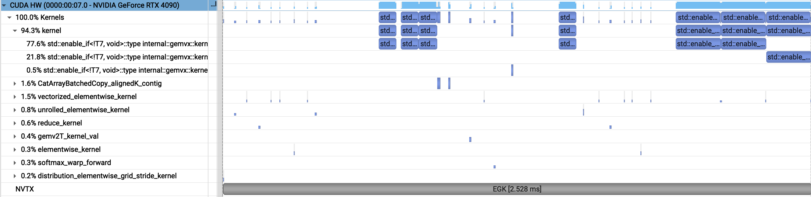
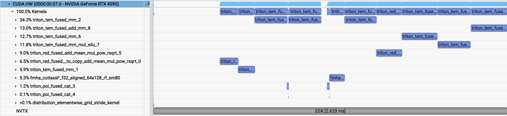
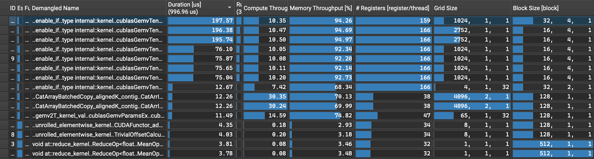
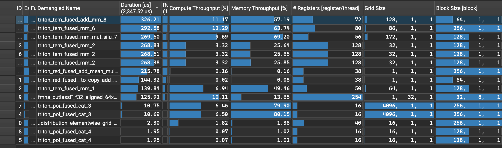
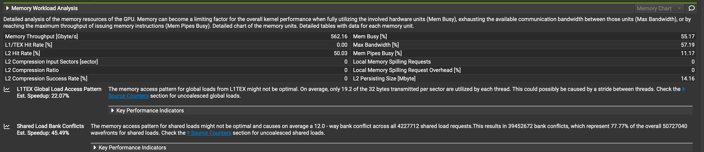

# Profiling Transformers with Nvidia Nsight

`minimal_llama.py` is a simplified adaptation of a Llama 2/3 type transformer layers using [HuggingFace transformers repo](https://github.com/huggingface/transformers) reference (up/down proj MLP + SwiGLU, RMSNorm, MHA, and similar dimensions). It's missing RoPE, GQA, and more optimized attention. This is a simple testbench for Nsight Systems and Nsight Compute to look into kernel performance.

## Comparison

Let's look at this layer in decode mode (generate a single token with the KV cache), and see how eager and compiled do, and on two different GPUs:
- RTX 3060 12GB
- RTX 4090 24GB

### Setup

Ubuntu VM instances via vast.ai.

| | Version |
|---|---|
| Python| 3.10.12 |
| PyTorch | 2.8.0 |
| CUDA | 12.8 | 12.8 |
| cuDNN | 91002 |
| Triton | 3.4.0 |
| Nsys | 2025.5.1.121 |
| Ncu | 2025.3.0.0 |
| Nvidia Driver | 580.82.07 |

The Nvidia driver needed to be upgraded to 580 to play nicely with Nsight Compute.

The profiling commands are as follows:
```bash
# Nsight Systems
TORCHINDUCTOR_UNIQUE_KERNEL_NAMES=1 nsys profile \
    --trace=cuda,nvtx \
    --capture-range=nvtx \
    --nvtx-capture 'BENCHMARK' \
    --capture-range-end=stop \
    --env-var=NSYS_NVTX_PROFILER_REGISTER_ONLY=0 \
    python minimal_llama.py --decode --compiled

# Nsight compute
ncu --set full -o report \
    --section SpeedOfLight --section MemoryWorkloadAnalysis  \
    --nvtx --nvtx-include "BENCHMARK/" --range-filter ::3 python minimal_llama.py --decode --compiled
```

The layer is run 20 times for warmup, and then NVTX ranges are used to extract just a single run.

### Results

Nsys shows kernel launches, and the time profiling of the runs (marked by NVTX ranges). The 4090 is speedy as expected, but the Torch compiled model is actually slower for both GPUs.

| | Eager \[ms\] | Compiled \[ms\] |
|---|---|---|
| 3060 | 3.05 | 3.57 |
| 4090 | 2.53 | 2.63 |

The Nsys GUI viewer on mac looks like this for, 4090+eager:

and for 4090+compiled:

despite lots of gaps for the eager version (kernel launch/memory movement), the inductor-fused kernels are underperforming. This is probably a sign I should use `'reduce-overhead'` instead of `'max-autotune'` (**TODO**). 

For 3060, the compiler maintains the cuBlas GEMMs, but for 4090, the compiled model uses Triton matmul. We can see the top duration kernels, which are dominated by GEMMs, from the ncu output:

Eager


Compiled


Since this is decode mode with small inputs, we'd expect to be memory rather than compute limited, which is supported by the numbers (low compute throughput%). The compiled model however seems to additionally be underutilizing DRAM bandwith (50-60% memory bandwidth for Triton GEMMs vs ~95% for cuBlas GEMMs). Nsight Compute even highlights this in the details page, e.g. for the top duration Triton matmul kernel:



This was just an exercise in the tooling, but from here we should guide the inductor better for the decode problem as well as pursue less memory intensive models (quantizing weights, GQA, etc).

